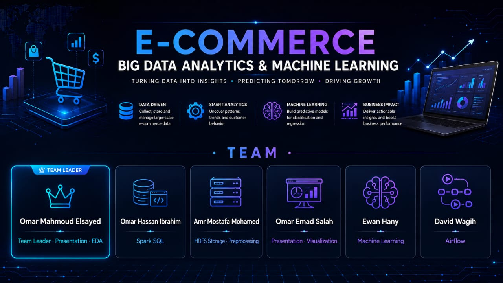
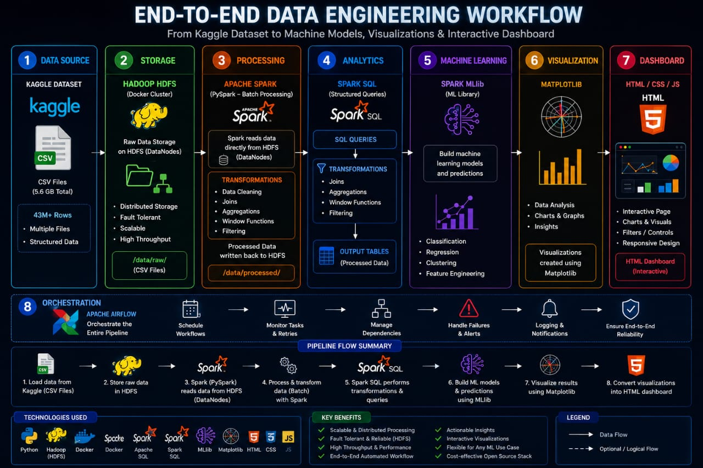
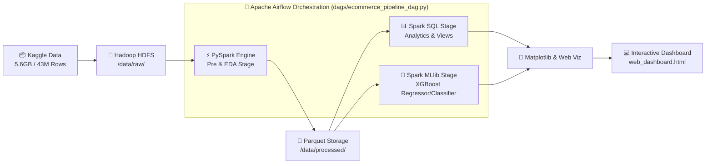

<div align="center">

# 🛒 E-COMMERCE BIG DATA ANALYTICS & MACHINE LEARNING
### *Turning Data into Insights • Predicting Tomorrow • Driving Growth*

[](https://spark.apache.org/)
[](https://hadoop.apache.org/)
[](https://airflow.apache.org/)
[](https://www.docker.com/)
[](https://xgboost.readthedocs.io/)
[](https://python.org)
[](web_dashboard.html)

---

[ 👥 Team Roster ](#-meet-the-team) • [ 🏗️ System Architecture ](#️-system-architecture--proposal) • [ ⚡ Pipeline Split ](#-notebook-split--architecture) • [ 🚀 Quick Start ](#-getting-started) • [ 📊 Web Dashboard ](#-interactive-web-dashboard)

</div>

---

## 🌟 Executive Summary & Core Pillars

This repository delivers an end-to-end, enterprise-grade **Big Data Analytics & Distributed Machine Learning Pipeline** engineered to process **43+ Million E-Commerce Clickstream Events (~5.6 GB)**. The architecture transitions raw HDFS store files through scalable PySpark transformation, Spark SQL analytics, MLlib machine learning, and Airflow orchestration, producing an interactive executive dashboard.

<div align="center">

| 🗄️ DATA DRIVEN | ⚙️ SMART ANALYTICS | 🧠 MACHINE LEARNING | 📈 BUSINESS IMPACT |
| :--- | :--- | :--- | :--- |
| Collect, store and manage large-scale e-commerce data on distributed HDFS clusters. | Uncover patterns, trends and customer behavior using Spark SQL structured queries. | Build predictive models for classification and regression using Spark MLlib & XGBoost. | Deliver actionable insights and boost business performance with an interactive HTML dashboard. |

</div>

---

## 👥 Meet the Team

<div align="center">



</div>

### 🌟 Project Contributors & Roles

| Avatar / Role | Member Name | Core Responsibilities & Contributions |
| :---: | :--- | :--- |
| 👑 **Team Leader** | **Omar Mahmoud Elsayed** | Team Leader • Presentation • EDA & Feature Engineering |
| ⚡ **Spark SQL Lead** | **Omar_Hassan Ibrahim** | Spark SQL Queries, Aggregations & Analytical Views |
| 🐘 **Data Engineer** | **Amr Mostafa Mohamed** | HDFS Storage Cluster Setup & Data Preprocessing Pipeline |
| 📊 **Viz Specialist** | **Omar Emad Salah** | Executive Presentation Deck & Data Visualizations |
| 🧠 **ML Specialist** | **Ewan Hany** | Spark MLlib & XGBoost Machine Learning Models |
| 🔄 **Airflow Architect**| **David Wagih** | Apache Airflow DAG Orchestration & Automation Workflow |

---

## 🏗️ System Architecture & Proposal

<div align="center">



</div>

### 🔄 End-to-End Pipeline Workflow



---

### 📋 Detailed Stage Breakdown

1. **Data Source (Kaggle Dataset)**
   - **Scale**: Multi-file e-commerce event log containing over **43M+ rows** (~5.6 GB).
   - **Schema**: User action events (`view`, `cart`, `purchase`), timestamps, product IDs, category IDs, prices, user session UUIDs.

2. **Distributed Storage (Hadoop HDFS)**
   - Stored in raw format under `/data/raw/` on DataNodes within Docker containers.
   - High-throughput, fault-tolerant, scalable read operations for PySpark workers.

3. **Batch Processing Engine (PySpark)**
   - Cleans missing categorical values, parses timestamps into dimensional features.
   - Aggregates clickstream events into session-level vectors (RFM metrics, cart-to-purchase ratios).
   - Exports optimized columnar Parquet files (`df_clean.parquet` & `session_dataset.parquet`) to `/data/processed/`.

4. **Analytics Engine (Spark SQL)**
   - Registers temporary relational views (`events` and `sessions`).
   - Executes complex window functions, retention metrics, conversion funnels, and sales distributions.

5. **Machine Learning Pipeline (Spark MLlib & XGBoost)**
   - Trains distributed `SparkXGBClassifier` for customer conversion/churn prediction.
   - Trains `SparkXGBRegressor` for user spend estimation.
   - Evaluates performance using RMSE, R², ROC-AUC, Precision, and Recall curves.

6. **Visualization Layer (Matplotlib)**
   - Converts Spark distributed aggregates into Pandas dataframes for zero-memory-leak plotting.
   - Generates publication-ready static & dynamic visual charts.

7. **Interactive Dashboard (HTML5 / CSS3 / JS)**
   - Standalone web presentation (`web_dashboard.html`) and slide presentation deck (`presentation.html`).
   - Features responsive grid, dark glassmorphism aesthetic, interactive metric counters, and light-box plot magnification.

8. **Orchestration & Workflow (Apache Airflow)**
   - Automated DAG execution using Papermill.
   - Handles parallel task execution, failure retries, dependency enforcement, and parameterized run logging.

---

## 📁 Repository Structure

```
NTI_Big_data_project/
├── 🖼️ architecture_proposal.jpeg   # System Architecture & Flow Proposal Diagram
├── 🖼️ team_banner.jpeg             # Project Team Roster Banner
│
├── 📁 preprocessing_EDA/           # STAGE 1: Data Preparation & Exploration
│   └── 📜 Pre_and_eda.ipynb        #   - Clean data, feature extraction, session aggregation
│                                   #   - Exports df_clean.parquet & session_dataset.parquet
│
├── 📁 ml/                          # STAGE 2: Machine Learning Modeling
│   └── 📜 ML_models.ipynb          #   - Spark MLlib + XGBoost classification & regression
│                                   #   - Model performance curves & metrics evaluation
│
├── 📁 sql/                         # STAGE 3: Analytical SQL Queries
│   └── 📜 SQL_analysis.ipynb       #   - 10+ Complex Spark SQL analytical queries
│                                   #   - Business KPI distributions & funnels
│
├── 📁 dags/                        # ORCHESTRATION: Apache Airflow DAG
│   └── 📜 ecommerce_pipeline_dag.py#   - Papermill execution DAG for sequential & parallel tasks
│
├── 🌐 web_dashboard.html           # Interactive HTML5/CSS3/JS Web Dashboard
└── 📽️ presentation.html            # Executive Big Data Pipeline Slide Presentation Deck
```

---

## ⚡ Notebook Split & Architecture

To optimize memory usage and allow modular scaling, the original single notebook was split into **3 isolated stages**:

```
                  ┌──────────────────────┐
                  │ Pre_and_eda.ipynb    │  (Stage 1: Preprocessing & Feature Engineering)
                  └──────────┬───────────┘
                             │
              ┌──────────────┴──────────────┐
              ▼                             ▼
   ┌────────────────────┐        ┌────────────────────┐
   │  ML_models.ipynb   │        │ SQL_analysis.ipynb │  (Stages 2 & 3: Run in Parallel!)
   └────────────────────┘        └────────────────────┘
```

> [!TIP]
> **Why Parallel Execution Works**: Both Stage 2 (ML) and Stage 3 (SQL) consume the serialized `.parquet` artifacts output by Stage 1. They do not depend on each other and can execute concurrently on separate worker nodes!

---

## 📦 Scoped Dependencies

Each notebook manages its dependencies efficiently without installing unnecessary bloat:

| Notebook Stage | Installed Dependencies | Purpose |
| :--- | :--- | :--- |
| `Pre_and_eda.ipynb` | `pyarrow` | Optimized Parquet writing & `.toPandas()` plotting conversion |
| `ML_models.ipynb` | `pyarrow`, `xgboost[spark]` | Parquet reading, plotting, and distributed `SparkXGBoost` modeling |
| `SQL_analysis.ipynb` | `pyarrow` | Parquet reading & Spark SQL visualization plotting |

---

## 🚀 Getting Started

### Option A: Manual Execution (Top-to-Bottom)

Run the notebooks sequentially or in parallel after Stage 1 finishes:

```bash
# 1. Execute Preprocessing & Feature Engineering
jupyter nbconvert --to notebook --execute preprocessing_EDA/Pre_and_eda.ipynb

# 2. Execute ML and SQL stages in parallel or sequentially
jupyter nbconvert --to notebook --execute ml/ML_models.ipynb
jupyter nbconvert --to notebook --execute sql/SQL_analysis.ipynb
```

### Option B: Automated Airflow Orchestration

1. Deploy the project folder into your Airflow `$AIRFLOW_HOME/dags/` directory.
2. Install worker dependencies:
   ```bash
   pip install papermill ipykernel pyspark pyarrow xgboost
   ```
3. Trigger the DAG:
   ```bash
   airflow dags trigger ecommerce_pyspark_pipeline
   ```

---

## 📊 Interactive Web Dashboard & Presentation

The project includes two standalone interactive web applications built with **HTML5, CSS3 (Glassmorphism & Neon Dark Theme), and Vanilla JavaScript**:

1. **`web_dashboard.html`**:
   - Live KPI counter cards (Total Revenue, Active Users, Conversions, Session Metrics).
   - High-resolution plot gallery with **Lightbox Zoom** capability.
   - Filterable controls for exploring pipeline results.

2. **`presentation.html`**:
   - Executive presentation deck outlining the Big Data pipeline design, HDFS architecture, Spark SQL insights, and XGBoost accuracy metrics.

---

<div align="center">

### 🎓 NTI Big Data Final Project
*Crafted with ❤️ by Team Leader **Omar Mahmoud Elsayed** and Team*

</div>


